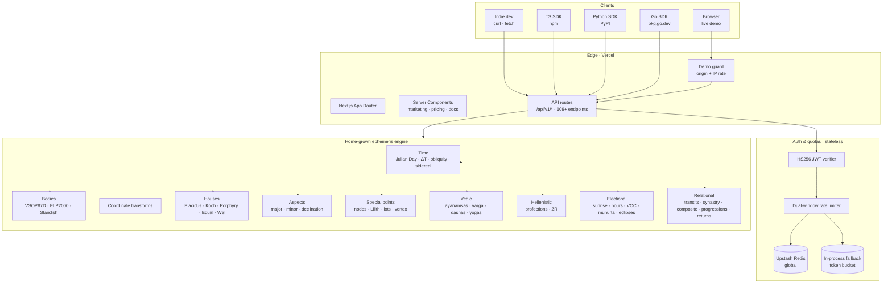
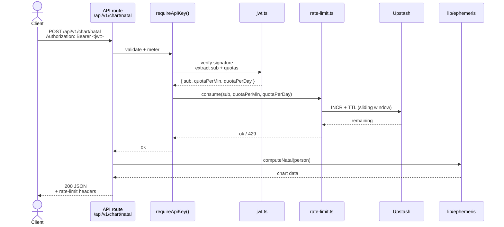

# 02 · Architecture

## System overview



One deploy target (Vercel). Two persistence dependencies (Upstash for rate-limit, none for auth). Zero external astro-math dependencies.

## Directory layout

```
tuffys-ai-astrology/
├── app/                          # Next.js App Router
│   ├── page.tsx                  # marketing home
│   ├── pricing/                  # three-tier pricing page
│   ├── docs/                     # static endpoint reference
│   │   └── api/                  # interactive Scalar explorer
│   ├── dashboard/                # live demo workspace
│   └── api/v1/                   # ← 109+ v1 handlers (43 at v1 launch)
│       ├── chart/
│       ├── vedic/
│       ├── transits/ ...
│       └── openapi.json/
├── lib/
│   ├── api/                      # HTTP concerns
│   │   ├── auth.ts               # requireApiKey() entry
│   │   ├── jwt.ts                # HS256 via Web Crypto
│   │   ├── api-keys.ts           # key resolution + denylist
│   │   ├── rate-limit.ts         # dual-backend limiter
│   │   ├── demo-guard.ts         # origin + IP on /api/birth-chart
│   │   └── __tests__/
│   └── ephemeris/                # ← engine, no I/O
│       ├── time/
│       ├── bodies/
│       │   └── vsop87/           # IMCCE coefficient data
│       ├── coords/
│       ├── houses/
│       ├── aspects/
│       ├── points/
│       ├── vedic/
│       ├── hellenistic/
│       ├── electional/
│       ├── relational/
│       ├── eclipses/
│       └── __tests__/            # ← Meeus golden files
├── sdk/
│   ├── typescript/               # npm publish source
│   └── python/                   # PyPI publish source
├── scripts/
│   ├── mint-api-key.mjs          # JWT minter
│   └── generate-vsop87.mjs       # IMCCE parser → TS modules
├── .github/workflows/
│   ├── ci.yml                    # PR gate
│   ├── publish-npm.yml           # npm release w/ provenance
│   └── publish-pypi.yml          # PyPI via OIDC
├── docs/
│   └── case-study/               # this document
├── screenshots/                  # marketing assets
└── README.md
```

**The engine has no HTTP. The API has no astronomy.** Every file is on exactly one side of that line. That's the single most load-bearing rule in the architecture — it's what makes the SDKs lightweight (they embed no math), what keeps the engine unit-testable (no mocks), and what lets the whole thing run at the edge (no binary deps).

## Request lifecycle

A chart request touches five layers:



Total: four function calls deep before any astronomy runs. No database lookups on the hot path. No external network calls except Upstash (which is single-digit-ms).

## Data flow — there isn't much

Deliberately. Ephemeris computation is pure:
```
(datetime, lat, lon, options) → chart
```
No user state, no persistence, no writes. That's why there's no Postgres, no Supabase, no ORM. The only "database" is Upstash, and it holds nothing but rate-limit counters that expire by design.

Everything else — API keys, quotas, scopes — lives inside signed JWTs. Revocation is a CSV env var. Scaling horizontally is adding instances; there's nothing to shard.

This is a deliberate inversion of the usual backend design: instead of "start from the DB and build up," start from the computation and resist every reason to add persistence. I only added Upstash because rate-limit counters are *inherently* stateful. If there had been a way to make that stateless too, I would have.

## External surfaces

| Surface | What | Why |
|---|---|---|
| `/` | Marketing home | Conversion funnel entry |
| `/pricing` | Three tiers + FAQ | Convert visitor → signup |
| `/docs` | Static endpoint reference | SEO-crawlable API docs |
| `/docs/api` | Scalar interactive explorer | Try-before-buy |
| `/dashboard` | Live natal-chart demo | Zero-friction first win |
| `/api/v1/*` |  The 109+ endpoints | The product |
| `/api/v1/openapi.json` | OpenAPI 3.1 spec | Tooling + SDK generation + docs |
| `/api/birth-chart` | Demo-tier chart | Free browser access (guarded) |

## What's missing (intentionally)

- **No GUI chart renderer as a standalone product.** The demo ships one. Rendering is not the business — data is.
- **No AI-written interpretations.** The API returns positions, aspects, dashas. Customers bring their own LLM.
- **No developer portal for key minting at v1.** I mint keys via CLI (`scripts/mint-api-key.mjs`) based on email. First 100 customers, a personal email is higher-signal than a self-serve form. Portal ships after that volume threshold.
- **No the dominant astronomy library fallback.** Even under pressure. Adding it once would normalize the option and erode the licensing story.

## Related decisions

- **[Engine from scratch](./03-decision-engine-from-scratch.md)** — why the engine box in the diagram above has zero third-party astro libraries
- **[Auth & rate limiting](./04-decision-auth-and-rate-limiting.md)** — why the auth/quota path is three files and no database
- **[SDK strategy](./06-sdk-strategy.md)** — why three SDKs, why zero runtime deps each

---

**Next:** [03 · Decision · engine from scratch](./03-decision-engine-from-scratch.md)
